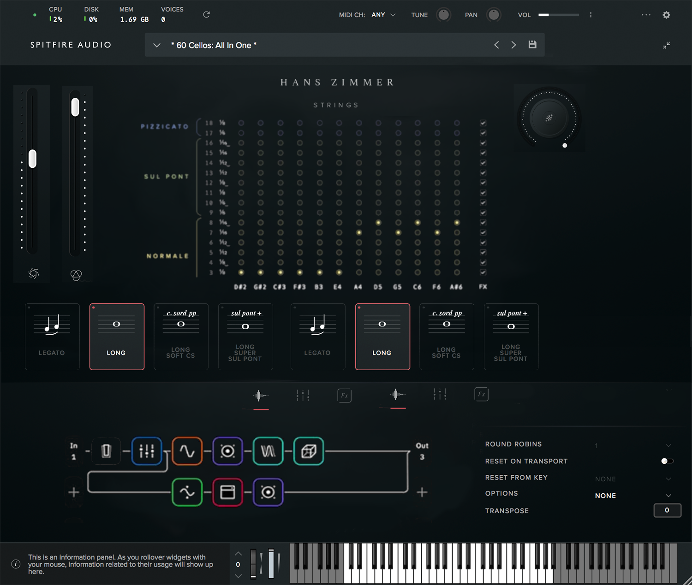

# opensampler
Ideas for open source sample plugin. Maybe augment decent sampler instead.

### High Level Design
 - **Preset Browser**: Can browse presets like normal. Can also browse, and automatically install/download pianobook instruments from inside the VST. Effects and plugins can be browsed the same way, but they are uploaded via the git repository.
 - **Batch Sample Processor**: Can take some set of samples, and apply some transformation, effect, etc to them and re-export
 - **Sample Loaders**: Takes a file or set of files, and maps it to keyboard
 - **MPE/MIDI Effects**: Takes a midi input, converts to MPE, and produces an MPE output
   - Arpegiators modeled after Olafur Arnalds piano. Scripting powerful enough to create grid like the spitfire one
   - Entire suite of generative effects
 - **Script Editor**: Embedded text editor for editing scripts
 - **Audio Effects**: Various effects like reverb, granular, etc
 - **UI Designer**: Can add knobs, faders, etc in scripts
 - **Eurorack integration**: Features to integrate with modular synths
 - **Auto sampler**: Like sample robot, create sample library from VST using embedded VST host
 - **Other features**: Embed VCVRack plugins, nice audio/mpe visualizers

### Todo
 - Follow the audio programmer tutorial on building a sampler

### Ideas
 - Use Julia language maybe??? Or Python or LUA.
 - Easy for people to write plugins in several languages
 - Embedded scripting window
 - Could design plugin using Max 8???
 - Can host VCVRack modules
 - Create a bunch of plugins for tape simulation, etc so people can improve their sample libraries
 - Integrate some other UI designer
 - Dynamically recompile UI as the user makes code changes
 - Deep integration with eurorack setups
 - Scripting window for my generative language

### Layout
 - Tools button in the corner, window is full screen.
   - Sample, effects, etc downloader (pianobook, other sources). Maybe this is seperate from the main tabs.
   - Batch sample processor (renderable ML effects, layer and export samples, paulstretch samples, etc)
 - Preset browser button in the corner, window is full screen
 - Some generative scripting language like tidalcycles. Use Julia or Faust since they can JIT. Can view source for any effect/module.
 - MPE/MIDI effects (suite of generative modules)
 - Selected samples and mapping
 - Selected synths and mapping
 - Audio effects and routing

### Promotion
 - Convert every pianobook library to this format programatically
 - Create amazing UIs
 - Create several awesome libraries to adverties it
 - Fantastic documentation
